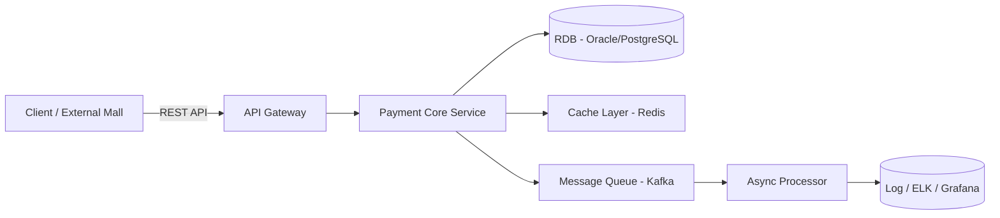

# 🧭 Payment Platform Architecture Design  
**Author:** Rluan (정재령)  
**Position Target:** NAVER Financial – Payment Platform Backend Developer  

---

## 🏗️ Overview

> **“안정성 위에 확장성을 쌓는다.”**  
결제 플랫폼은 단 한 번의 결제 실패도 신뢰를 잃게 만드는 구조입니다.  
따라서 시스템을 설계할 때 가장 먼저 고려하는 것은 **정확성과 무결성**,  
그 위에 **성능**과 **확장성**을 얹는 것을 원칙으로 합니다.

---

## ⚙️ Architecture Summary

아래는 실제 PG 및 상품권 시스템 개발 경험을 바탕으로 설계한  
**결제 승인/취소 프로세스 아키텍처 예시**입니다.

**핵심 포인트:**
- API Gateway에서 요청 검증 및 공통 응답 구조화
- 결제 승인 로직은 **Sync**, 이후 보조 로직은 **Async(Kafka)** 처리  
- Redis를 활용한 **중복 결제 방지 / 세션 관리**
- Elastic APM & Grafana 기반 모니터링 구성

---

## 🧩 Key Design Decisions

| 항목 | 선택한 방법 | 이유 |
|------|--------------|------|
| 트랜잭션 관리 | Programmatic Transaction (Spring) | 멀티 DB 환경에서 세밀한 제어 가능 |
| API 응답 구조 | 표준 Response Wrapper (code/message/data) | 현업, 외부몰 일관성 유지 |
| 장애 대응 | Kafka DLQ + 재시도 로직 | 외부 VAN 연동 실패 자동 복구 |
| 캐싱 전략 | Redis Key 구분: user/session/transaction | 동시 결제 Lock 충돌 방지 |
| 모니터링 | Elastic APM + Grafana | 트랜잭션 병목/지연 구간 실시간 파악 |

---

## 🚀 Performance Optimization Case

| 구분 | Before | After | 개선 방법 |
|------|---------|--------|------------|
| 결제 승인 평균 응답시간 | 1.5초 | 0.05초 | SQL 튜닝, 조건 최적화, 중복 쿼리 제거 |
| 상품권 충전 처리시간 | 2.5초 | 1.5초 | 인덱스 추가, 쿼리 구조 개선 |
| 배치 프로그램 실행시간 | 15분 | 3분 | Stream 처리 + Bulk Insert 구조 변경 |

**주요 개선 포인트**
- Connection Pool (HikariCP) 파라미터 조정  
- DB 인덱스 정비 및 Lock 경합 최소화  
- 배치 로직에서 비즈니스 로직 분리 및 병렬 처리

---

## 🔍 Monitoring & Quality Assurance

- **Elastic APM**: 트랜잭션 단위 성능 모니터링  
- **Grafana Dashboards**: 시스템 리소스 & 응답 시간 시각화  
- **Slack + Jenkins CI/CD**: 빌드 & 배포 자동화 + 장애 알림  
- **Swagger**: API 명세 자동화 및 협업 개선  

---

## 🤝 Collaboration & Communication

- 기획, 정산, DBA 파트와 **데이터 기준 정의 워크숍** 진행  
- 장애 발생 시 **Slack 알림 → 원인 분석 → Hotfix 배포** 프로세스 직접 운영  
- 신규 기능 추가 시, **Swagger + Notion 설계 문서** 병행 작성으로 소통 강화  

---

## 📚 Tech Stack Summary

| 구분 | 기술 |
|------|------|
| Backend | Java, Spring Boot, MyBatis, JPA(학습 중) |
| Infra | Jenkins, Docker, Kubernetes(사내 환경) |
| DB | Oracle, PostgreSQL, MSSQL |
| Monitoring | Elastic APM, Grafana(학습 중), Jennifer X-View |
| Messaging | Kafka(학습 중), Redis(적용 예정) |
| Dev Tools | GitHub, IntelliJ, Confluence, Swagger |

---

## 🧠 My Development Principles

1. **Why → How → What** 순으로 접근  
   - 단순 구현보다 “왜 이 구조가 필요한가”를 먼저 고민  
2. **가독성과 유지보수성을 우선**  
   - 나 아닌 다른 개발자가 읽었을 때 바로 이해할 수 있는 코드  
3. **문제의 원인에 집중하는 태도**  
   - 증상 해결보다 근본 원인을 파악하는 것이 진짜 성장이라고 생각  

---

## 🌱 Next Steps

- Kafka 기반 **비동기 결제 시뮬레이터** 프로젝트 진행 중  
- Redis를 활용한 **결제 Lock & 트랜잭션 캐시 구조** 설계 예정  
- Kotlin 기반 **Spring Boot 모듈 실습** (Java → Kotlin 마이그레이션)  
- Grafana로 **실시간 모니터링 대시보드** 구축  

---

## 📎 Reference & Contact

- GitHub: [https://github.com/dev-Rluan](https://github.com/dev-Rluan)  
- Blog: [https://rluan.dev](https://rluan.dev)  
- Email: dev.rluan@gmail.com  

> _“한 번의 결제 성공 뒤에는 수백 번의 안정성 검증이 있다.”_
